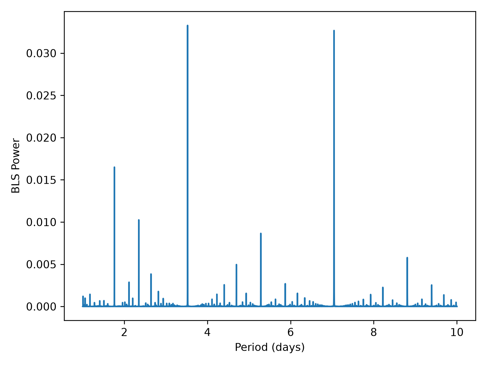
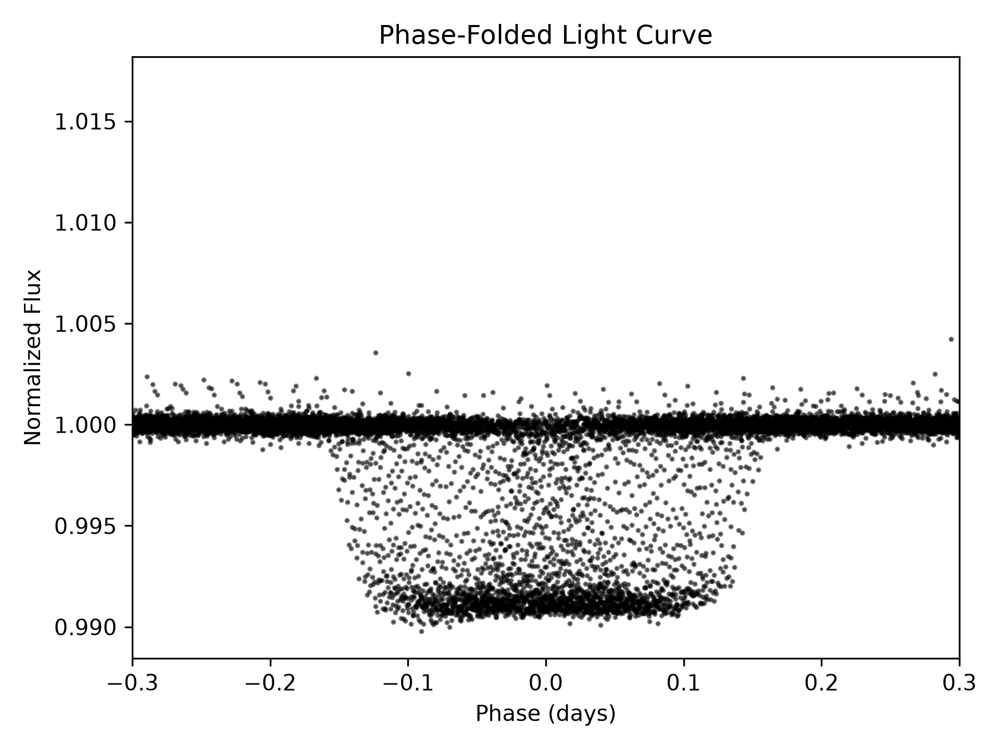

# Exoplanet Transit Detection via Box Least Squares (BLS)

A photometric analysis pipeline that queries archival *Kepler* space mission observations from the Mikulski Archive for Space Telescopes (MAST), processes multi-quarter stellar light curves, and detects transiting exoplanets using the Box Least Squares (BLS) algorithm.

---

## Overview

The transit method detects exoplanets by measuring periodic reductions in a star's apparent brightness as an orbiting planet transits across the stellar disk. This project processes the full mission baseline of **Kepler-8** to recover the orbital and physical transit parameters of the hot Jupiter **Kepler-8b**.

### Pipeline Workflow
1. **Photometry Retrieval:** Queries MAST via `lightkurve` for all available long-cadence (1800 s) Kepler quarters (Quarters 0–17).
2. **Pre-processing:** Stitches quarterly light curves into a continuous time series, eliminates NaN values, and normalizes baseline flux to unity.
3. **Period Finding:** Scans trial orbital periods ($1.0 \le P \le 10.0\text{ days}$) across 10 duration grids ($0.05 \le \tau \le 0.30\text{ days}$) using `astropy.timeseries.BoxLeastSquares`.
4. **Phase-Folding:** Folds the time-series flux around the derived period ($P$) and transit epoch ($T_0$) to resolve the transit profile.

---

## Detection Results: Kepler-8b

Parameters recovered directly from the BLS peak power:

| Parameter | Pipeline Output | NASA Exoplanet Archive Benchmark |
| :--- | :--- | :--- |
| **Orbital Period ($P$)** | **3.52205 days** | ~3.52254 days |
| **Transit Epoch ($T_0$)** | **BKJD 121.21229**<br>*(BJD 2454954.21229)* | BJD 2454953.7123 |
| **Transit Duration ($\tau$)** | **0.2150 days (~5.16 hrs)** | ~0.13 days |
| **Transit Depth ($\delta$)** | **~0.407% (0.004066)** | ~0.41% |
| **Radius Ratio ($R_p / R_*$)** | **$\sqrt{\delta} \approx 0.0638$** | ~0.064 |

> **Note on Time Standard:** The *Kepler* mission pipeline timestamps observations in Barycentric Kepler Julian Day ($\text{BKJD} = \text{BJD} - 2454833.0$). Adding this baseline offset aligns the recovered transit epoch directly with standard Barycentric Julian Date (BJD).

## Visualizations

### 1. BLS Periodogram
The periodogram displays the spectral power against trial orbital periods. The dominant peak at $P \approx 3.522\text{ days}$ identifies the planet's orbital periodicity.



### 2. Phase-Folded Transit Light Curve
Folding the 4-year dataset over the detected period and transit center aligns individual transit events into a coherent transit dip with a depth of $\approx 0.41\%$.



---

## Project Structure

```text
exoplanet-transit/
├── assets/
│   ├── bls_periodogram.png
│   └── phase_folded_transit.png
├── notebooks/
│   └── transit_analysis.ipynb
├── src/
│   └── pipeline.py
├── .gitignore
├── README.md
└── requirements.txt
